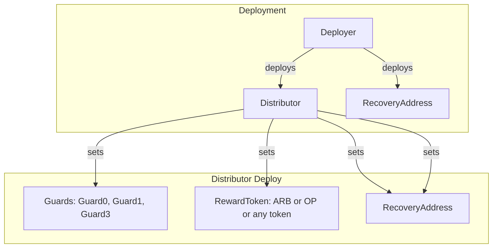
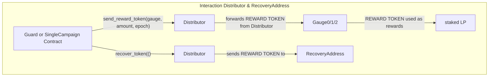
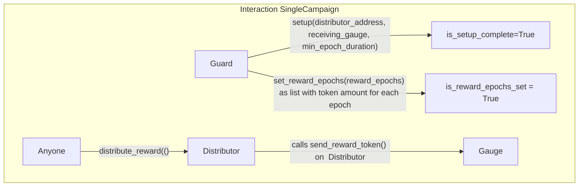
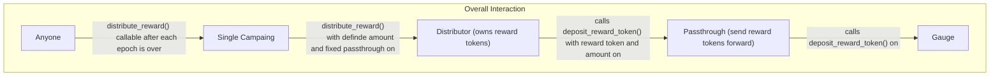

# Automagic Reward Distribution

## Overview
This system consists of two main contracts (Distributor and SingleCampaign) designed for managing liquidty incentives on L2 networks. Multiple campaigns can be run in series, with new deployments for each distribution period. Distributor can be run on its own without SingleCampaigns, but then transactions have to be executed manually on every epoch

## Distributor Contract
- Restricts `deposit_reward_token()` to a predefined set of gauge addresses specified at contract creation, if SingleCampaigns are used, the deployment address of the SingleCampaign needs to be added to the guard list during deployment of the Distributor
- Guards can control timing and size of rewards but cannot directly access funds
- If a RecoveryAddress is set, guards can recover funds only to this address

## SingleCampaign Contract
- Manages predefined reward epochs for a single gauge through the Distributor
- Deplyoment addresses of SingleCampaign instances needs to be added to guard list during deployment of the Distributor. Because of this SingleCampaign have to be deployed before the Distributor.
- Features:
  - Pre-scheduled reward epochs with fixed amounts
  - Public `distribute_reward()` function that anyone can call after an epoch ends
  - Optional crvUSD incentive system (0.1 crvUSD paid to callers who trigger distributions)

## Usage Lifecycle
1. Deploy multiple SingleCampaign contracts for a specific distribution period
2. Collect all SingleCampaign contract addresses
3. Deploy Distributor with collected SingleCampaign addresses as guards
4. For each SingleCampaign:
   - Set Distributor address and receiving gauge
   - Configure reward epochs
5. Fund Distributor with reward tokens
6. Anyone can call `distribute_reward()` to start distributions
7. Contract becomes inactive after period ends
8. No funds should remain in contracts after completion of a period

## Important Notes
- L2-only implementation (Not gas efficient)
- One-time use per period (requires redeployment for new periods)
- Zero-fund target: All funds should be distributed by period end

## Definitions

- campaign: a single distribution period for a single gauge
- guards: addresses that can call `deposit_reward_token()` on the Distributor
- epoch: time for one reward distribution on a single gauge, in seconds
- reward_epochs: list of token amounts for each epoch for a single gauge
- reward: payment for providing liquidity to a specific liquidity pool
- gauge: this contract allows staked LP token to get rewared for the liquidiy they provide to a specific liquidity pool
- LP token: token that represents a share of a liquidity pool
- recovery_address: address on the Distributor to send back funds to a RecoveryAddress
- name: a human readable name for a campaign
- id: a unique identifier for a campaign

# Flowchart

## Deploy Distributor



## Interaction with Distributor



## Interaction with SingleCampaign


## Overall Interaction



## Hints

### Taiko

* vyper 4.0.0 verification with "shanghai" on https://taikoscan.io/


## Install

```
python -m venv .venv
source .venv/bin/activate
pip install --upgrade pip
pip install eth-ape'[recommended-plugins]'
ape plugins install arbitrum
ape test
```

## changelog

### V 0.0.3

- allow more guards to have more campaings as backup
- renamed remove_reward_epochs() to  end_campaign() in SingleCampaign
- allow to remove_active_campaign_address(), without remove of reward.epochs()

## Passtrough

https://arbiscan.io/address/0xB1a17c8BCb17cd0FDAb587c6b09749b021861E70


pro-commit hock
